# GAN - Generator/Adversarial-evaluator Network

Orchestrates superpowers skills into a GAN-inspired pipeline: grill the spec, generate tests before code, build entirely with subagents, then evaluate with fresh adversarial eyes.

**Announce at start:** "I'm using the GAN skill to build this with adversarial evaluation."

<HARD-GATE>
PLANNING FIRST — NO EDITS UNTIL PLANNING IS DONE.

Phases 1–3 (Brainstorming, Grilling, Planning) are PLANNING-ONLY phases. During these phases:
- Do NOT use the Edit, Write, or NotebookEdit tools on any source/test/config files
- Do NOT dispatch subagents that write code
- Do NOT create implementation files of any kind
- The ONLY files you may write/edit are: progress.md, life.md, AGENTS.md, design docs, and plan docs

The first code edit of any kind is permitted ONLY after Phase 3 (Planning) is fully approved by the user.

Do NOT skip the grilling phase (Phase 2), test suite generation (Phase 4), or adversarial evaluation (Phase 6). These are the core value of this skill.
</HARD-GATE>

## When to Use

**Use GAN when:**
- Building a new application or major feature from a brief prompt (1-4 sentences)
- Task complexity is at the edge of reliable single-agent output
- You want quality assurance beyond self-review
- Multi-feature implementations where integration bugs hide

**Do NOT use when:**
- Simple CRUD, single-page apps, small utilities (superpowers chain is sufficient)
- Bug fixes (use superpowers:systematic-debugging)
- Tasks with highly interactive/iterative user feedback loops (brainstorming handles this)

## Progress Tracking

Three files are maintained throughout the entire pipeline:

**`progress.md`** — Updated after EVERY phase transition:
- What was completed
- Current status and phase
- Next steps
- Test results (once tests exist)
- Blockers or decisions needed

**`life.md`** — Learnings and discoveries:
- Grilling findings (decisions, risks parked, assumptions surfaced)
- Surprises during implementation
- Evaluation results and what they revealed
- Patterns worth remembering

**`AGENTS.md`** — Updated with links to useful facts for future agents:
- Key architecture decisions and WHERE they're documented (file paths)
- Non-obvious behaviors discovered during grilling (with file:line references)
- Pitfalls and gotchas that would waste a future agent's time
- Integration points between components (which files talk to which)
- Links to specs, design docs, and test suites created during this build
- Format: actionable pointers — "Read X before touching Y", "Z is configured in W"

<HARD-GATE>
Update progress.md at the END of every phase. Update life.md whenever something is learned or discovered. Update AGENTS.md whenever a useful fact is discovered that would help a future agent working on this codebase. These are not optional.
</HARD-GATE>

## Process Flow

```dot
digraph gan_process {
    rankdir=TB;

    subgraph cluster_phase1 {
        label="Phase 1 — Brainstorming";
        style=dashed;
        "superpowers:brainstorming" [shape=box];
        "User approves design?" [shape=diamond];
    }

    subgraph cluster_phase2 {
        label="Phase 2 — Grilling (MANDATORY)";
        style=filled fillcolor=lightyellow;
        "Identify decision branches" [shape=box];
        "Pick weakest branch" [shape=box];
        "Ask one hard question" [shape=box];
        "Branch resolved?" [shape=diamond];
        "More branches?" [shape=diamond];
        "Record findings in life.md" [shape=box];
    }

    subgraph cluster_phase3 {
        label="Phase 3 — Planning";
        style=dashed;
        "superpowers:writing-plans" [shape=box];
    }

    subgraph cluster_phase4 {
        label="Phase 4 — Test Suite Generation (MANDATORY)";
        style=filled fillcolor=lightyellow;
        "Generate test cases from spec" [shape=box];
        "Write comprehensive test suite" [shape=box];
        "Verify all tests FAIL" [shape=box];
        "Record test plan in progress.md" [shape=box];
    }

    subgraph cluster_phase5 {
        label="Phase 5 — Generation (subagents ONLY)";
        style=dashed;
        "superpowers:subagent-driven-development" [shape=box];
        "Update progress.md per task" [shape=box];
    }

    subgraph cluster_phase6 {
        label="Phase 6 — Adversarial Evaluation";
        style=filled fillcolor=lightyellow;
        "Dispatch evaluator subagent" [shape=box];
        "PASS or FAIL?" [shape=diamond];
        "Record evaluation in life.md" [shape=box];
    }

    subgraph cluster_phase7 {
        label="Phase 7 — Iteration";
        style=dashed;
        "Feed EVALUATION.md to fix subagent" [shape=box];
        "Re-evaluate" [shape=box];
        "Rounds < 2?" [shape=diamond];
        "Escalate to user" [shape=box];
    }

    "Finish" [shape=doublecircle label="Phase 8 — superpowers:finishing-a-development-branch"];

    "superpowers:brainstorming" -> "User approves design?";
    "User approves design?" -> "superpowers:brainstorming" [label="revise"];
    "User approves design?" -> "Identify decision branches" [label="approved"];
    "Identify decision branches" -> "Pick weakest branch";
    "Pick weakest branch" -> "Ask one hard question";
    "Ask one hard question" -> "Branch resolved?";
    "Branch resolved?" -> "Ask one hard question" [label="no / vague"];
    "Branch resolved?" -> "More branches?" [label="yes"];
    "More branches?" -> "Pick weakest branch" [label="yes"];
    "More branches?" -> "Record findings in life.md" [label="no"];
    "Record findings in life.md" -> "superpowers:writing-plans";
    "superpowers:writing-plans" -> "Generate test cases from spec";
    "Generate test cases from spec" -> "Write comprehensive test suite";
    "Write comprehensive test suite" -> "Verify all tests FAIL";
    "Verify all tests FAIL" -> "Record test plan in progress.md";
    "Record test plan in progress.md" -> "superpowers:subagent-driven-development";
    "superpowers:subagent-driven-development" -> "Update progress.md per task";
    "Update progress.md per task" -> "Dispatch evaluator subagent";
    "Dispatch evaluator subagent" -> "PASS or FAIL?";
    "PASS or FAIL?" -> "Record evaluation in life.md" [label="PASS"];
    "Record evaluation in life.md" -> "Finish";
    "PASS or FAIL?" -> "Feed EVALUATION.md to fix subagent" [label="FAIL"];
    "Feed EVALUATION.md to fix subagent" -> "Re-evaluate";
    "Re-evaluate" -> "Rounds < 2?";
    "Rounds < 2?" -> "Dispatch evaluator subagent" [label="yes"];
    "Rounds < 2?" -> "Escalate to user" [label="no"];
    "Escalate to user" -> "Finish";
}
```

## Phase 1 — Brainstorming

**REQUIRED SUB-SKILL:** Use superpowers:brainstorming to explore intent, propose approaches, get user approval, and write design doc.

**Update progress.md:** Record design decisions and approved approach.
**Update AGENTS.md:** Add links to the design doc and any key architecture decisions made.

## Phase 2 — Grilling (MANDATORY)

<HARD-GATE>
Do NOT skip grilling. The design from Phase 1 MUST be pressure-tested before planning.
</HARD-GATE>

After brainstorming produces a design, grill it relentlessly:

**Setup:**
1. Read the approved design doc
2. Identify every decision branch — architecture choices, trade-offs, assumptions, missing pieces, edge cases, failure modes
3. Rank branches by weakness (most hand-wavy or risky first)

**Questioning — one question at a time, depth-first:**
- **"What if..."** — failure scenarios, scale limits, edge cases
- **"Why not..."** — alternatives not picked
- **"What happens when..."** — state transitions, error paths, race conditions
- **"How do you know..."** — unvalidated assumptions
- **"What's the rollback if..."** — reversibility
- **Contradictions** — point out when two parts of the design conflict
- **Missing pieces** — name what the design doesn't address

**Follow-up relentlessly:**
- Vague answer -> ask for specifics
- "We'll figure it out later" -> ask what "later" looks like concretely
- Hand-wave -> restate what you heard and ask if that's really the plan
- Don't move on until the branch is resolved or user explicitly parks it

**Track state:**
- Maintain tree of branches (resolved / unresolved / parked)
- After resolving a branch, acknowledge and move to next weakest
- Periodically show progress: "3 of 7 branches resolved, moving to [next topic]"

**Completion:** All branches resolved or explicitly parked.

**Update life.md:** Record all findings — decisions made, assumptions validated, risks parked with reasons.
**Update progress.md:** Grilling complete, N branches resolved, M parked.
**Update AGENTS.md:** Add pitfalls, non-obvious constraints, and "read X before touching Y" pointers discovered during grilling.

## Phase 3 — Planning

**REQUIRED SUB-SKILL:** Use superpowers:writing-plans to create bite-sized implementation plan from the grilled and approved design.

**Review checkpoint:** Read the plan. Confirm it captures the user's intent and incorporates grilling findings.

**Update progress.md:** Plan created, number of tasks, estimated complexity.
**Update AGENTS.md:** Add link to the implementation plan and any key file mapping (which files own which responsibilities).

## Phase 4 — Test Suite Generation (MANDATORY)

<HARD-GATE>
Do NOT write any implementation code before the test suite exists and all tests are verified to FAIL. This is non-negotiable TDD.
</HARD-GATE>

After the plan is approved, generate a comprehensive test suite:

1. **Extract test cases from spec and plan:**
   - Every specified behavior gets at least one test
   - Every edge case identified during grilling gets a test
   - Every error path gets a test
   - Integration tests for cross-feature workflows

2. **Write the test suite:**
   - Dispatch a subagent to write all tests
   - Tests must be runnable and assert on expected behavior
   - Tests serve as acceptance criteria for the evaluator phase

3. **Verify all tests FAIL:**
   - Run the entire test suite
   - Every test MUST fail (no implementation exists yet)
   - If a test passes, it's testing existing behavior, not new behavior — fix or remove it

**Update progress.md:** Test suite created, N test cases covering M behaviors, all failing.
**Update AGENTS.md:** Add link to test suite and note which test files cover which features.

## Phase 5 — Generation (Subagents ONLY)

<HARD-GATE>
ALL coding is done by subagents. The controller NEVER writes implementation code directly. Always use superpowers:subagent-driven-development.
</HARD-GATE>

**REQUIRED SUB-SKILL:** Use superpowers:subagent-driven-development
- Fresh subagent per task + two-stage review (spec then quality)
- Each subagent receives the relevant test cases to make pass
- After each task, run the test suite and report which tests now pass

**Update progress.md** after each completed task:
- Task completed
- Tests passing: X/N
- Tests still failing: list
- Next task

<HARD-GATE>
Do NOT invoke superpowers:finishing-a-development-branch yet. The GAN evaluator runs first.
</HARD-GATE>

## Phase 6 — Adversarial Evaluation

A **separate subagent with fresh context** evaluates the entire implementation against the spec.

### Escape Hatch: When to Skip

Skip the evaluator ONLY if ALL of these are true:
- Task is well within baseline model capability (simple CRUD, single utility)
- Subagent-driven-development's built-in spec + quality reviews already passed cleanly
- No integration concerns across features
- ALL tests pass

If skipping, proceed directly to Phase 8.

### Evaluator Dispatch

Dispatch a fresh general-purpose subagent using the template at `./evaluator-prompt.md`.

Provide the evaluator with:
- The original design doc path
- The implementation plan path
- The test suite results
- The git diff of all changes (`git diff <base>...HEAD`)
- Instructions to test like a real user

### Grading Rubric

| Criterion | What to evaluate | Fail threshold |
|-----------|-----------------|----------------|
| **Product depth** | Real features vs scaffolding? Edge cases handled? Complete workflows? | < 6 |
| **Functionality** | Features work end-to-end? User can complete core workflows? | < 7 |
| **Visual design** | UI cohesive and polished? Colors, typography, layout form distinct identity? | < 5 |
| **Code quality** | Clean, well-structured, maintainable? Error handling at boundaries? | < 6 |
| **Test coverage** | Tests comprehensive? All passing? Edge cases covered? | < 7 |

### Evaluator Output

The evaluator writes `EVALUATION.md` in the project root.

**Update life.md:** Record evaluation scores, what was surprising, what the builders missed.
**Update progress.md:** Evaluation complete, verdict, scores.
**Update AGENTS.md:** Add any integration gotchas, surprising behaviors, or "if you change X, also update Y" dependencies found by the evaluator.

## Phase 7 — Iteration (if evaluator fails)

If the evaluator returns FAIL:

1. Dispatch a **new fix subagent** with the original design, plan, and `EVALUATION.md` feedback
2. Instruction: "Fix ONLY the issues identified in EVALUATION.md. Do not refactor or change working features."
3. After fixes, run the full test suite — no regressions allowed
4. Dispatch the evaluator again (fresh subagent)

<HARD-GATE>
Maximum 2 iteration rounds. After 2 failed rounds, STOP and present EVALUATION.md to the user for guidance.
</HARD-GATE>

**Update progress.md:** Iteration round N, issues fixed, re-evaluation result.

## Phase 8 — Finish

After evaluator PASS (or user override after escalation):

**REQUIRED SUB-SKILL:** Use superpowers:finishing-a-development-branch to verify tests, present merge/PR options, and clean up.

**Final progress.md update:** Project complete, final test results, evaluation scores, total iterations.
**Final life.md update:** Summary of what was learned building this project.
**Final AGENTS.md update:** Review and consolidate all entries. Ensure every section has actionable file:line pointers. Remove stale references. This is the primary artifact that survives for future agents.

## Key Principles

1. **Grill before you build** — pressure-test every assumption before writing a line of code
2. **Tests before implementation** — comprehensive test suite is the acceptance criteria
3. **Subagents do all coding** — controller orchestrates, never implements
4. **Separate generation from evaluation** — never let the builder judge its own work
5. **Track everything** — progress.md, life.md, and AGENTS.md are living documents updated every phase
6. **Bounded iteration** — max 2 fix rounds prevents infinite loops
7. **Fresh eyes for evaluation** — evaluator subagent has zero generation context

## Red Flags

| Thought | Reality |
|---------|---------|
| "Let me scaffold the project while we plan" | NO edits until Phase 3 is approved. Zero. |
| "I'll just create the directory structure" | That's an edit. Planning first. |
| "The prompt is clear, skip grilling" | Grilling is mandatory. Always. |
| "Tests can come after, I know what to build" | TDD is non-negotiable. Tests first. |
| "I'll just write this one function myself" | ALL code via subagents. No exceptions. |
| "Code reviews already passed, skip evaluator" | Per-task review != holistic product evaluation |
| "I'll have the generator also evaluate" | Defeats the entire GAN purpose |
| "Third fix round will get it" | Stop. Escalate to user after 2 rounds |
| "I'll update progress.md at the end" | Update after EVERY phase. Not optional. |
| "life.md is busywork" | It captures discoveries that inform future decisions |
| "AGENTS.md can wait until the end" | Add facts as you find them — you'll forget details later |

## Integration

**Required superpowers skills:**
- **superpowers:brainstorming** — Phase 1: explore intent and design
- **superpowers:writing-plans** — Phase 3: create implementation plan
- **superpowers:subagent-driven-development** — Phase 5: generate (always, no alternatives)
- **superpowers:finishing-a-development-branch** — Phase 8: merge/PR/cleanup

**GAN-specific artifacts:**
- `./evaluator-prompt.md` — Evaluator subagent dispatch template
- `EVALUATION.md` — Written by evaluator in project root
- `progress.md` — Living progress tracker (project root)
- `life.md` — Learnings and discoveries (project root)
- `AGENTS.md` — Actionable fact index for future agents (project root, survives beyond the build)
