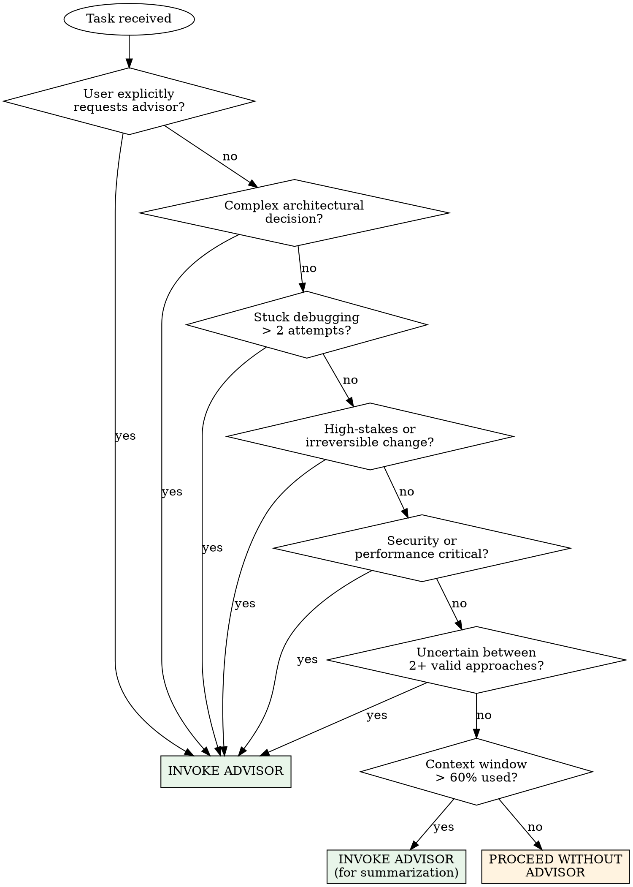
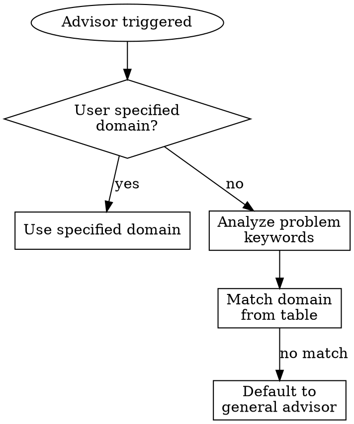
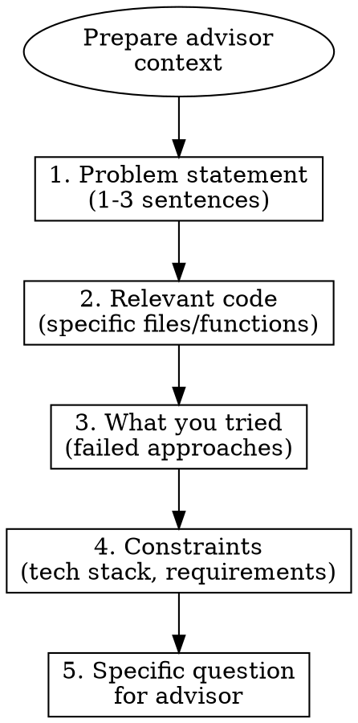
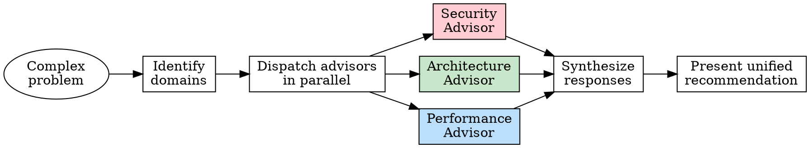

---
name: advisor-strategy
description: Use when facing complex architectural decisions, debugging dead-ends, high-stakes code changes, security reviews, performance optimization, or when the user explicitly requests advisor consultation. Also use when context is growing large and needs management, or when a second opinion from a more capable model would improve decision quality. Triggers on keywords like "use advisor", "consult advisor", "ask opus", "security review", "architecture check".
---

# Advisor Strategy for Claude Code

## Overview

The Advisor Strategy pairs a high-capability model (Claude Opus 4.6) as a strategic advisor with the current executor model (Sonnet/Haiku) for day-to-day work. The executor handles primary tasks end-to-end. When facing decisions it cannot confidently resolve, it consults the advisor for guidance, code review, architectural direction, or debugging insight.

**Core principle:** Escalate to a stronger model when the stakes justify it — don't guess when you can consult.

**Origin:** Based on [Anthropic's Advisor Strategy](https://claude.com/blog/the-advisor-strategy) for the Messages API, adapted for Claude Code's Agent tool.

## When to Use



### Explicit Triggers (user-initiated)
- "use advisor", "consult advisor", "get a second opinion"
- "ask opus", "escalate this", "I want the advisor on this"
- Mentioning a specific domain: "security review this", "architecture check"

### Autonomous Triggers (agent-initiated)
- **Architectural decisions**: System design, API design, database schema, major refactors
- **Debugging dead-ends**: Stuck after 2+ failed attempts, root cause unclear
- **High-stakes changes**: Production configs, auth systems, data migrations, CI/CD pipelines
- **Security-sensitive code**: Auth, crypto, input validation, permission systems
- **Performance-critical paths**: Hot loops, database queries, caching strategies
- **Trade-off decisions**: Multiple valid approaches, unclear which is best
- **Context management**: Conversation growing large, need to summarize and refocus

### When NOT to Use
- Simple, well-understood tasks (CRUD, boilerplate, formatting)
- Tasks where the answer is clearly documented
- When the user explicitly says not to use the advisor
- Trivial bug fixes with obvious causes

## Advisor Configuration

### Default Model

```
Model: opus (Claude Claude Opus 4.6)
Fallback: NONE — inform user and ask
```

**If Opus is unavailable**, tell the user:

> "The Opus advisor model is currently unavailable. I can continue without advisor consultation, but note that:
> - Complex architectural decisions may lack the depth of analysis an advisor provides
> - Security-sensitive reviews benefit from a second, more capable model
> - I may miss edge cases that the advisor would catch
>
> Would you like me to proceed with the current model, or wait until Opus is available?"

### Changing the Advisor Model

To use a different advisor model, tell the main agent:
- "use sonnet as advisor" or "advisor model: sonnet"
- This is useful when Opus is unavailable or for cost-conscious workflows

The model parameter maps to Claude Code's Agent tool `model` field:
- `opus` → Claude Claude Opus 4.6
- `sonnet` → Claude Claude Sonnet 4.6
- `haiku` → Claude Claude Haiku 4.5

## Domain Advisors

The advisor can be specialized by domain. Each domain advisor gets a tailored prompt that focuses its analysis.

### Available Domains

| Domain | Trigger Keywords | Focus |
|--------|-----------------|-------|
| **Architecture** | "design", "structure", "refactor", "scale" | System design, patterns, modularity, extensibility |
| **Security** | "auth", "security", "vulnerability", "permissions" | OWASP top 10, auth flows, input validation, secrets |
| **Performance** | "slow", "optimize", "latency", "memory" | Profiling, caching, algorithmic complexity, DB queries |
| **Debugging** | "stuck", "failing", "can't figure out", "root cause" | Root cause analysis, hypothesis generation, test strategies |
| **Code Quality** | "review", "clean up", "best practice" | Readability, maintainability, testing, patterns |
| **Context Manager** | "summarize context", "context is large", auto-triggered | Distill conversation state, identify key decisions, compress |

### Auto-Detection

When invoking the advisor autonomously, detect the domain from context:



## Context Management Protocol

**This is critical.** The advisor must receive focused context, not a raw dump.

### What to Send



### What NOT to Send
- Full conversation history
- Irrelevant files or code
- Tool call logs
- Previous advisor responses (unless building on them)

### Context Budget
- **Problem statement**: Max 3 sentences
- **Code context**: Only the specific files/functions relevant (read them fresh, don't paste from memory)
- **Failed approaches**: Brief summary, not full debug logs
- **Constraints**: Only those that affect the decision

## How to Invoke the Advisor

### Step 1: Announce

Before invoking, tell the user what you're doing:

```
I'm consulting the **[Domain] Advisor** (Claude Opus 4.6) on [specific question].
```

### Step 2: Dispatch Sub-Agent

Use the Agent tool with these parameters:

```
Agent(
  description: "[Domain] advisor consultation"
  model: "opus"
  prompt: <structured prompt from templates below>
  subagent_type: "general-purpose"
)
```

**IMPORTANT:** Always use `model: "opus"` (or configured model). The `"opus"` value is Claude Code's shorthand for Claude Opus 4.6 — this is the entire point of the skill: leveraging a more capable model for strategic decisions.

### Step 3: Present Response

Format the advisor's response for the user:

```markdown
---
**Advisor Response** ([Domain] · Claude Opus 4.6)

[Advisor's analysis and recommendations]

---
```

Then synthesize and continue:
```
Based on the advisor's analysis, I'll proceed with [chosen approach] because [reasoning].
```

## Advisor Prompt Templates

### General Advisor

```
You are a senior technical advisor. You have been consulted by another AI agent
that is working on a task and needs your expert guidance.

## Problem
[Problem statement — 1-3 sentences]

## Relevant Code
[Specific files/functions — read fresh, include file paths and line numbers]

## What Has Been Tried
[Brief summary of failed approaches]

## Constraints
[Tech stack, requirements, deadlines, user preferences]

## Question
[Specific question for you to answer]

## Instructions
- Provide clear, actionable advice
- If you need to read files to give better advice, do so
- If providing code, make it complete and ready to use
- Identify risks or edge cases the executor may have missed
- If the question is unclear, state your assumptions
- Be direct — the executor needs to act on your advice immediately
- Structure your response as:
  1. Assessment (what's going on)
  2. Recommendation (what to do)
  3. Implementation (code or steps if applicable)
  4. Risks (what could go wrong)
```

### Architecture Advisor

```
You are a senior software architect advisor. Another AI agent is consulting you
on an architectural decision.

## System Context
[What the system does, tech stack, scale]

## Design Question
[Specific architectural question]

## Current State
[Relevant code structure, existing patterns]

## Constraints
[Performance requirements, team size, timeline, compatibility needs]

## Options Being Considered
[Approaches the executor is weighing]

## Instructions
- Evaluate trade-offs between approaches
- Consider: modularity, testability, extensibility, operational complexity
- Recommend a specific approach with justification
- Identify migration/implementation risks
- If you need to read files for more context, do so
- Provide skeleton code or interface definitions if helpful
- Structure your response as:
  1. Analysis of each option
  2. Recommended approach
  3. Key interfaces/contracts
  4. Migration strategy (if applicable)
  5. What to watch out for
```

### Security Advisor

```
You are a senior security engineer advisor. Another AI agent is consulting you
on security-sensitive code.

## Component Under Review
[What the code does, its role in the system]

## Code
[The specific code to review — include file paths]

## Known Threat Model
[What threats are relevant — auth bypass, injection, data exposure, etc.]

## Specific Concerns
[What the executor is worried about]

## Instructions
- Review for OWASP Top 10 vulnerabilities
- Check authentication and authorization logic
- Verify input validation and output encoding
- Look for secrets exposure, insecure defaults, missing rate limiting
- If you need to read additional files for context (middleware, configs), do so
- Provide specific fixes, not just warnings
- Rate severity: CRITICAL / HIGH / MEDIUM / LOW
- Structure your response as:
  1. Findings (severity-ordered)
  2. Specific fixes (code)
  3. Recommendations for hardening
  4. What to test
```

### Performance Advisor

```
You are a senior performance engineer advisor. Another AI agent is consulting you
on performance-critical code.

## Performance Issue
[What's slow, what the target is]

## Code
[The specific code path — include file paths]

## Metrics
[Any measurements, benchmarks, or profiles available]

## Constraints
[Acceptable latency, memory budget, compatibility requirements]

## Instructions
- Identify bottlenecks in the code path
- Analyze algorithmic complexity
- Check for unnecessary allocations, N+1 queries, missing indexes
- If you need to read additional files (schemas, configs), do so
- Provide optimized code, not just suggestions
- Estimate impact of each optimization
- Structure your response as:
  1. Bottleneck analysis
  2. Optimizations (ordered by impact)
  3. Optimized code
  4. Expected improvement
  5. Trade-offs of each optimization
```

### Debugging Advisor

```
You are a senior debugging specialist advisor. Another AI agent has been
stuck debugging an issue and needs your help with root cause analysis.

## Symptom
[What's failing, error messages, unexpected behavior]

## What Has Been Tried
[Approaches attempted, what they revealed]

## Relevant Code
[Code suspected to be involved — include file paths]

## Environment
[OS, runtime, dependencies, versions if relevant]

## Instructions
- Analyze the symptom and form hypotheses
- Rank hypotheses by likelihood
- For each hypothesis, suggest a specific diagnostic step
- If you need to read files to investigate, do so
- Look for: race conditions, state corruption, edge cases, environment differences
- Don't just confirm the executor's hypothesis — consider alternatives
- Structure your response as:
  1. Hypothesis ranking (most likely first)
  2. Diagnostic steps for each
  3. Most likely root cause
  4. Suggested fix
  5. How to verify the fix
```

### Context Manager Advisor

```
You are a context management specialist. The current conversation has grown large
and needs to be distilled so the executor can continue effectively.

## Current Task
[What the user is trying to accomplish]

## Key Decisions Made So Far
[Important decisions and their rationale]

## Current State
[Where things stand — what's done, what's pending]

## Active Problems
[Any unresolved issues or blockers]

## Instructions
- Distill the conversation into a compact summary
- Preserve: decisions, rationale, current state, pending work
- Discard: tool output details, exploration dead-ends, verbose logs
- Identify the critical context the executor needs going forward
- Structure your response as:
  1. Task summary (1-2 sentences)
  2. Key decisions (bulleted, with rationale)
  3. Current state (what's done, what's not)
  4. Pending work (prioritized)
  5. Critical context (anything the executor must not forget)
```

## Multi-Advisor Consultations

For complex problems spanning multiple domains, you can consult multiple advisors:



**To dispatch in parallel**, use multiple Agent tool calls in a single message, each with `model: "opus"` and the appropriate domain prompt.

**When synthesizing**, look for:
- Conflicts between advisors (security vs performance trade-offs)
- Reinforcing recommendations (multiple advisors agree)
- Gaps (something no advisor covered)

Present conflicts explicitly to the user for decision-making.

## Shared Decision-Making

The advisor provides analysis, but decisions flow through a structured process:

1. **Advisor provides analysis** with ranked recommendations
2. **Executor evaluates** against project constraints and user preferences
3. **Executor presents** advisor's recommendation + own assessment
4. **User decides** (or executor proceeds if autonomous mode)

```markdown
**Advisor recommends:** [Approach A] because [reasons]
**My assessment:** I agree/disagree because [context the advisor didn't have]
**Recommendation:** [Final recommendation]
**Proceeding with:** [Chosen approach] — let me know if you'd prefer otherwise.
```

## Token Budget Guidelines

| Component | Budget |
|-----------|--------|
| Problem statement | ~50-100 tokens |
| Code context | ~500-2000 tokens (read fresh, trim to relevant) |
| Failed approaches | ~100-200 tokens |
| Constraints | ~50-100 tokens |
| Advisor prompt template | ~200-400 tokens |
| **Total per consultation** | **~1000-3000 tokens input** |

**Rule of thumb:** If your advisor prompt exceeds 3000 tokens, you're sending too much context. Trim it.

## Edge Cases

### Main Agent Is Already Opus
If you're already running as Opus, the advisor pattern still has value:
- **Second opinion**: A fresh Opus instance without your conversation's cognitive load
- **Parallel analysis**: Dispatch advisor while you continue other work
- **Domain focus**: Advisor gets a clean, focused prompt without 100k tokens of prior context

### User Says "Don't Use Advisor"
Respect it. Do not consult the advisor. If you believe it's genuinely risky to proceed without one (e.g., security-critical auth), warn the user once:
> "I'll proceed without the advisor as requested. Note that auth code benefits from a second review — let me know if you change your mind."

Then proceed. Do not ask repeatedly.

### Advisor Disagrees With Your Analysis
Present both perspectives to the user:
```markdown
**Advisor recommends:** [Approach A] because [reasons]
**My assessment differs:** I lean toward [Approach B] because [reasons from conversation context]
**Key difference:** [What the advisor may not have seen vs. what you may have missed]
```

Let the user decide. Do not silently override the advisor.

## Rationalization Table

| Excuse for Skipping Advisor | Reality |
|-----------------------------|---------|
| "This is a standard pattern, I know this" | Standard patterns have standard vulnerabilities. 30s of advisor time prevents hours of debugging. |
| "The user said to be quick" | Speed pressure ≠ skip review. Make the consultation fast, not absent. |
| "I'll review it myself after" | Self-review catches less than fresh-eyes review. That's the whole point. |
| "It's just a small change" | Small auth/security changes cause the biggest breaches. |
| "The advisor will just agree with me" | Then the consultation costs 30s and confirms you're right. Worth it. |
| "I don't want to slow the user down" | Announce the consultation, dispatch, present — takes under a minute. |
| "I'm already on Opus, no point" | Fresh context + domain focus > exhausted context window. |

## Common Mistakes

| Mistake | Fix |
|---------|-----|
| Sending full conversation to advisor | Extract only the relevant problem + code |
| Using advisor for trivial tasks | Only escalate when stakes/complexity justify it |
| Ignoring advisor recommendations silently | Always present advisor output to user |
| Not reading files fresh for advisor | Read the actual files, don't paste from earlier context |
| Forgetting to specify `model: "opus"` | The whole point is the more capable model |
| Over-consulting (every decision) | Trust your judgment for routine work |
| Under-consulting (never escalating) | When uncertain on high-stakes decisions, consult |
| Not announcing advisor invocation | Always tell the user before consulting |
| Raw-dumping advisor response | Synthesize — add your assessment and recommendation |

## Quick Reference

| Action | How |
|--------|-----|
| Invoke advisor | `Agent(model: "opus", prompt: <template>)` |
| Specify domain | Use domain-specific prompt template |
| Multi-advisor | Multiple Agent calls in one message |
| Change model | User says "advisor model: sonnet" |
| Skip advisor | User says "don't use advisor" or "skip advisor" |
| Context management | Use Context Manager advisor template |
| Check availability | If Agent with opus fails, inform user with drawbacks |

## Integration with Other Skills

- **superpowers:systematic-debugging** → After 2 failed debug attempts, trigger Debugging Advisor
- **superpowers:writing-plans** → Consult Architecture Advisor before finalizing plans
- **superpowers:brainstorming** → Use General Advisor to evaluate brainstormed options
- **superpowers:test-driven-development** → Consult advisor on test strategy for complex features
