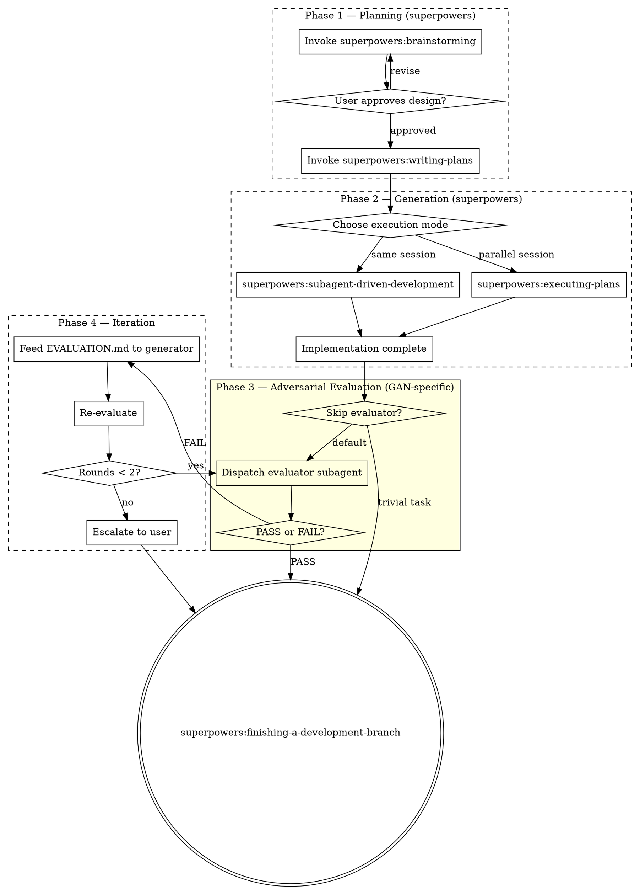

# GAN - Generator/Adversarial-evaluator Network

Orchestrates superpowers skills into a GAN-inspired pipeline: separate generation from evaluation using a fresh-eyes adversarial reviewer. The key insight — the agent that built the code has a blindspot for its own flaws.

**Announce at start:** "I'm using the GAN skill to build this with adversarial evaluation."

<HARD-GATE>
Do NOT skip the adversarial evaluation phase (Phase 3) unless the escape hatch criteria below are met. The entire value of this skill is the separation of generation from evaluation.
</HARD-GATE>

## When to Use

**Use GAN when:**
- Building a new application or major feature from a brief prompt (1-4 sentences)
- Task complexity is at the edge of reliable single-agent output
- You want quality assurance beyond self-review
- Multi-feature implementations where integration bugs hide

**Do NOT use when:**
- Simple CRUD, single-page apps, small utilities (superpowers chain is sufficient)
- Bug fixes (use superpowers:systematic-debugging)
- Tasks with highly interactive/iterative user feedback loops (brainstorming handles this)

## Process Flow

## Phase 1 — Planning

Delegate entirely to superpowers. Do not reinvent planning.

1. **REQUIRED SUB-SKILL:** Use superpowers:brainstorming to explore intent, propose approaches, get user approval, and write design doc
2. **REQUIRED SUB-SKILL:** Use superpowers:writing-plans to create bite-sized implementation plan from the approved design

**Review checkpoint:** Read the plan. Confirm it captures the user's intent before proceeding.

## Phase 2 — Generation

Delegate to superpowers execution skills. Offer the user the choice:

**Option A — Subagent-Driven (this session)**
- **REQUIRED SUB-SKILL:** Use superpowers:subagent-driven-development
- Fresh subagent per task + two-stage review (spec then quality)

**Option B — Parallel Session (separate)**
- **REQUIRED SUB-SKILL:** Use superpowers:executing-plans
- Batch execution with human checkpoints

<HARD-GATE>
Do NOT invoke superpowers:finishing-a-development-branch yet. The GAN evaluator runs first.
</HARD-GATE>

## Phase 3 — Adversarial Evaluation

A **separate subagent with fresh context** evaluates the entire implementation against the spec. This is what superpowers does not have natively.

### Escape Hatch: When to Skip

Skip the evaluator ONLY if ALL of these are true:
- Task is well within baseline model capability (simple CRUD, single utility)
- Subagent-driven-development's built-in spec + quality reviews already passed cleanly
- No integration concerns across features

If skipping, proceed directly to Phase 5.

### Evaluator Dispatch

Dispatch a fresh general-purpose subagent using the template at `./evaluator-prompt.md`.

Provide the evaluator with:
- The original design doc path
- The implementation plan path
- The git diff of all changes (`git diff <base>...HEAD`)
- Instructions to test like a real user

### Grading Rubric

The evaluator grades against four criteria on a 1-10 scale:

| Criterion | What to evaluate | Fail threshold |
|-----------|-----------------|----------------|
| **Product depth** | Real features vs scaffolding? Edge cases handled? Complete workflows? | < 6 |
| **Functionality** | Features work end-to-end? User can complete core workflows? | < 7 |
| **Visual design** | UI cohesive and polished? Colors, typography, layout form distinct identity? | < 5 |
| **Code quality** | Clean, well-structured, maintainable? Error handling at boundaries? | < 6 |

### Evaluator Output

The evaluator writes `EVALUATION.md` in the project root containing:
- Score per criterion with justification
- **PASS** or **FAIL** verdict
- If FAIL: prioritized list of issues with concrete fix descriptions and file:line references

## Phase 4 — Iteration (if evaluator fails)

If the evaluator returns FAIL:

1. Dispatch a **new generator subagent** with the original design, plan, and `EVALUATION.md` feedback
2. Instruction: "Fix ONLY the issues identified in EVALUATION.md. Do not refactor or change working features."
3. After fixes, dispatch the evaluator again (fresh subagent)

<HARD-GATE>
Maximum 2 iteration rounds. After 2 failed rounds, STOP and present EVALUATION.md to the user for guidance. Do not attempt a third fix cycle.
</HARD-GATE>

## Phase 5 — Finish

After evaluator PASS (or user override after escalation):

**REQUIRED SUB-SKILL:** Use superpowers:finishing-a-development-branch to verify tests, present merge/PR options, and clean up.

## Key Principles

1. **Separate generation from evaluation** — never let the builder judge its own work
2. **Delegate to superpowers** — do not reinvent planning, execution, or branch management
3. **Fresh eyes for evaluation** — evaluator subagent has zero generation context, eliminating confirmation bias
4. **Concrete fail thresholds** — numeric scores prevent rubber-stamping
5. **Bounded iteration** — max 2 fix rounds prevents infinite loops
6. **Escape hatch for simple tasks** — skip evaluator when overkill, but default is ON

## Red Flags

| Thought | Reality |
|---------|---------|
| "Code reviews already passed, skip evaluator" | Per-task review != holistic product evaluation |
| "I'll have the generator also evaluate" | Defeats the entire GAN purpose |
| "Third fix round will get it" | Stop. Escalate to user after 2 rounds |
| "The prompt is clear, skip brainstorming" | Brainstorming is required. Always. |
| "Simple enough to skip the evaluator" | Check ALL escape hatch criteria first |

## Integration

**Required superpowers skills:**
- **superpowers:brainstorming** — Phase 1: explore intent and design
- **superpowers:writing-plans** — Phase 1: create implementation plan
- **superpowers:subagent-driven-development** OR **superpowers:executing-plans** — Phase 2: generate
- **superpowers:finishing-a-development-branch** — Phase 5: merge/PR/cleanup

**GAN-specific artifacts:**
- `./evaluator-prompt.md` — Evaluator subagent dispatch template
- `EVALUATION.md` — Written by evaluator in project root
